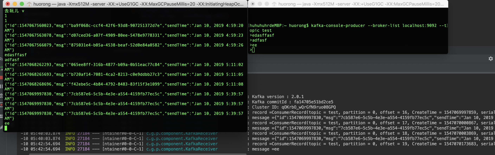

# kafaka-mac
[TOC]
## 学习目标
-[] 
## 安装kafka
- brew update
- brew install kafka
	- 位置:/usr/local/Cellar/kafka/2.1.0
## 启动方式
	zookeeper-server-start /usr/local/etc/kafka/zookeeper.properties & kafka-server-start /usr/local/etc/kafka/server.properties
	brew services start kafka和brew services start zookeeper
## 创建主题test
	kafka-topics --create --zookeeper localhost:2181 --replication-factor 1 --partitions 1 --topic test
## 查看创建的topic
	kafka-topics --list --zookeeper localhost:2181
## 生产者生产数据
	kafka-console-producer --broker-list localhost:9092 --topic test
## 消费者
	kafka-console-consumer --bootstrap-server localhost:9092 --topic test --from-beginning
## 整合springboot
### pom
``` java
<dependency>
    <groupId>org.springframework.kafka</groupId>
    <artifactId>spring-kafka</artifactId>
    <version>2.2.2.RELEASE</version>
</dependency>
```
### 配置
``` java
# kafka
spring.kafka.bootstrap-servers=localhost:9092
spring.kafka.consumer.group-id=test
spring.kafka.consumer.key-deserializer=org.apache.kafka.common.serialization.StringDeserializer
spring.kafka.consumer.value-deserializer=org.apache.kafka.common.serialization.StringDeserializer
spring.kafka.producer.key-serializer=org.apache.kafka.common.serialization.StringSerializer
spring.kafka.producer.value-serializer=org.apache.kafka.common.serialization.StringSerializer
```
### 生产者
``` java
@Component
public class KafkaSender {
    @Autowired
    private KafkaTemplate<String, String> kafkaTemplate;
    private Gson gson = new GsonBuilder().create();
    public void send(Message message) {
        kafkaTemplate.send("test", gson.toJson(message));
    }
}
``` 
### 消费者
``` java

@Component
@Slf4j
public class KafkaReceiver {
    @KafkaListener(topics = {"test"})
    public void listen(ConsumerRecord<?, ?> record) {
        Optional<?> kafkaMessage = Optional.ofNullable(record.value());
        if (kafkaMessage.isPresent()) {
            Object message = kafkaMessage.get();
            log.info("record =" + record);
            log.info("message =" + message);
        }
    }
}
```
## 终端结果展示

## 参考文献
[印象笔记 Markdown 入门指南][1]
[1]: https://list.yinxiang.com/markdown/eef42447-db3f-48ee-827b-1bb34c03eb83.php
[CSDN-Spring Boot集成Kafka][2]
[2]: https://blog.csdn.net/guijiaoba/article/details/78637375
[Spring for Apache Kafka][3]
[3]:https://docs.spring.io/spring-kafka/docs/2.2.2.RELEASE/reference/html/
[kafka学习路线][4]
[4]:https://www.baidu.com/s?ie=utf-8&f=8&rsv_bp=1&rsv_idx=1&tn=baidu&wd=kafka%E5%AD%A6%E4%B9%A0%E8%B7%AF%E7%BA%BF&oq=%2526gt%253BTL%25E4%25B8%258Akafka%25E5%25AD%25A6%25E4%25B9%25A0%25E8%25B7%25AF%25E7%25BA%25BF&rsv_pq=d79a747d0001a559&rsv_t=1607CULT%2BvC1cpwxtxhBXoMjWBQpvX6d38eea0X3OWYomU09huwcW0%2FrG%2FE&rqlang=cn&rsv_enter=1&rsv_sug3=1&rsv_sug2=0&inputT=485&rsv_sug4=486